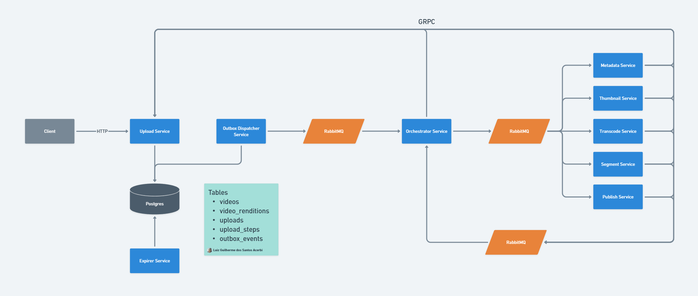

# Go Video Upload Monorepo

Study-oriented **Go** monorepo for **video upload → process → publish**: microservices, transactional outbox, RabbitMQ, Postgres, and gRPC—not production-hardening, but an end-to-end map of common patterns.

## Prerequisites

- **Docker Desktop** (Compose v2) — run the full stack with `docker compose`
- **Go 1.24+** — workspace tests, lint, `go run` per service, proto generation

## Quick start

### Non-production defaults

Compose uses dev-friendly secrets and ports in `docker-compose.yml`. On shared machines or any untrusted network: copy `.env.example` to `.env`, set strong values, avoid exposing ports you don’t need, and rotate default credentials.

### Start

```bash
# From repo root
docker compose up -d --build
```

Optional secrets file:

```bash
cp .env.example .env
```

Optional internal-infra profile (after creating `docker-compose.override.yml` from `docker-compose.override.example.yml`):

```bash
docker compose --profile internal-infra up -d --build
```

### Database schema / migrations

Migrations run on `docker compose up` via the `db-migrate` one-shot service. Manual run:

```bash
docker compose --profile tools run --rm db-schema
```

### Stop

```bash
docker compose down
```

Remove data volumes (Postgres / Influx / Grafana):

```bash
docker compose down -v
```

### Useful URLs (host)

| Service        | URL |
|----------------|-----|
| Upload API     | `http://localhost:8080` |
| Upload gRPC    | `localhost:9090` |
| E2E client UI  | `http://localhost:3000` |
| Adminer        | `http://localhost:8081` |
| Grafana        | `http://localhost:3001` |
| InfluxDB       | `http://localhost:8086` |
| LocalStack (S3)| `http://localhost:4566` |
| RabbitMQ UI    | `http://localhost:15672` (`admin` / `admin`) |

### E2E client API key

The e2e app sends `X-Api-Key` via `VITE_UPLOAD_API_KEY`. In Compose, upload `SECRET_TOKEN` and `VITE_UPLOAD_API_KEY` come from `API_SHARED_TOKEN` so they stay aligned. That is for **local dev only**; shipping API keys in frontend assets is not a production auth model.

## Architecture

Upload finalize commits domain state and **`outbox_events`** in one transaction; **outbox-dispatcher** publishes to RabbitMQ; the **orchestrator** advances the pipeline; **workers** use object storage and **upload gRPC** to persist progress in Postgres.



Diagram source: [`docs/system_design.png`](docs/system_design.png).

### Capabilities

- **Async pipeline** — Three logical queues: outbox → orchestrator, orchestrator → step workers, workers → orchestrator for completions.
- **Transactional outbox** — No lost “something happened” signals when the broker is down at commit time; dispatcher relays after the fact.
- **Orchestrated steps** — Metadata, thumbnail, transcode, segment, publish as separate workers; orchestrator owns order and progression.
- **Shared data model** — Postgres (`videos`, `uploads`, `upload_steps`, `outbox_events`, etc.) as the source of truth across services.
- **Multi-protocol** — HTTP for client upload (e.g. presign/finalize), AMQP for work, gRPC (`proto/`) for upload service calls from orchestrator and workers.
- **Lifecycle** — **expirer** service cleans up time-limited or stale upload-related data.

### Patterns in the codebase

- Bounded-context microservices (upload, orchestrator, workers, outbox-dispatcher, expirer)
- Hexagonal-style ports with Postgres, RabbitMQ, and object-storage adapters
- Presigned PUT to S3-compatible storage so bytes bypass the API

## Repository layout

| Path | Role |
|------|------|
| `services/upload` | REST upload API |
| `services/orchestrator` | Pipeline coordination |
| `services/outbox-dispatcher` | Outbox → broker |
| `services/expirer` | Upload/data expiry |
| `services/metadata`, `thumbnail`, `transcode`, `segment`, `publish` | Pipeline workers |
| `pkg/` | Shared libs (config, logger, middleware, models, RabbitMQ helpers, …) |
| `proto/` | gRPC / protobuf contracts |
| `db/` | SQL schema / migration inputs |
| `docs/` | Design assets (e.g. system diagram) |

## Development

From repo root, `go.work` ties workspace modules together. Run a service from its directory, for example:

```bash
cd services/upload && go run ./cmd/server
```

…or rely on Docker Compose for the full graph.

## Commands

```bash
# Tests (from repo root)
go test ./...

# Lint
golangci-lint run ./...

# Generate Go from protos
./scripts/proto-gen.sh
```
